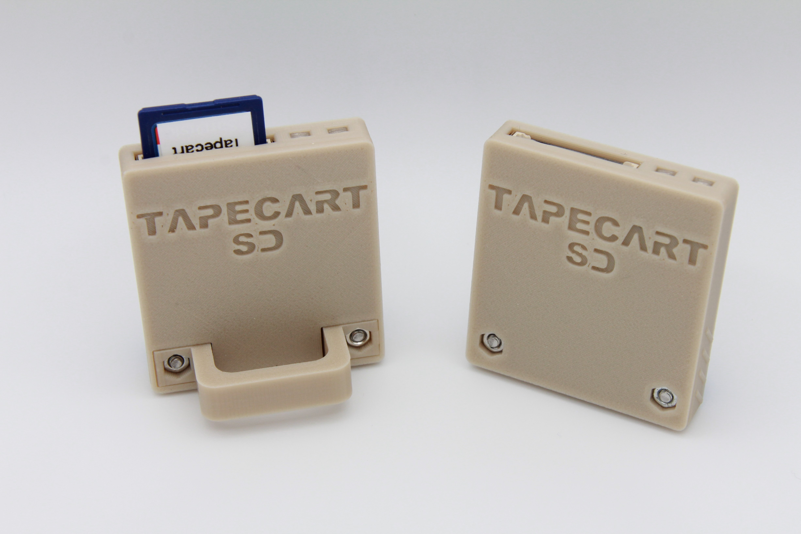
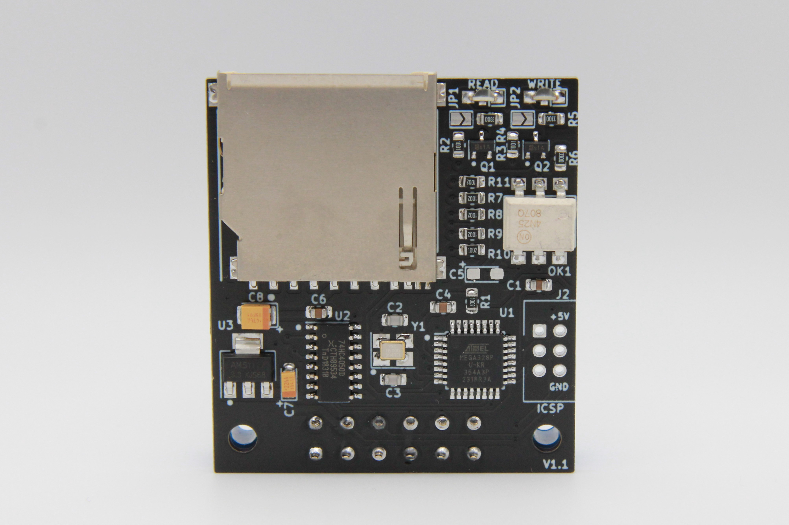
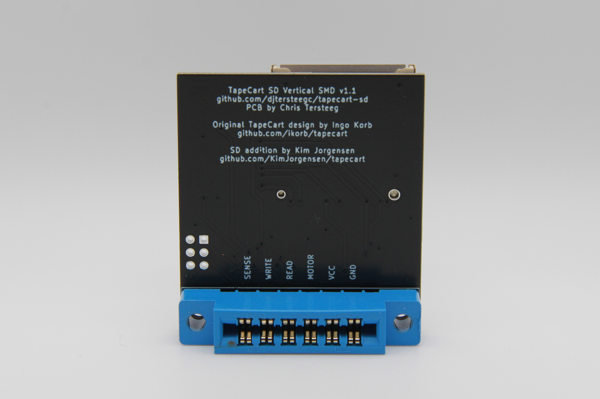
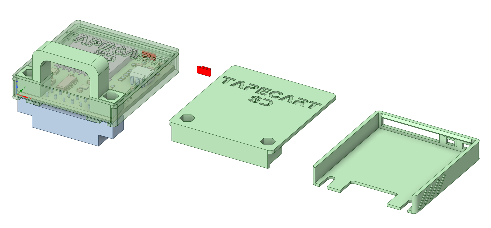
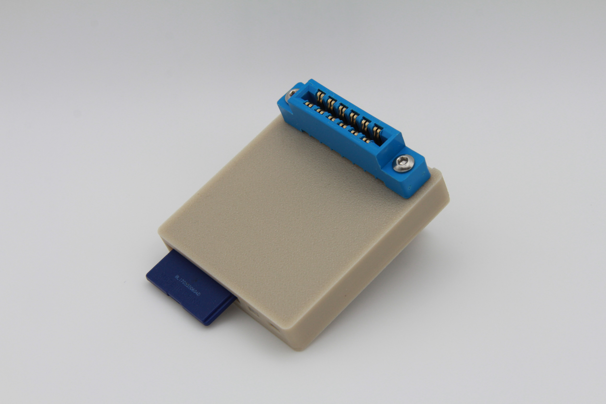
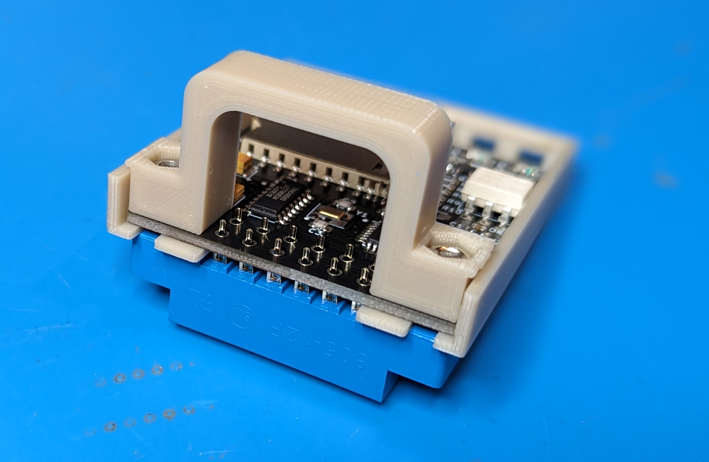
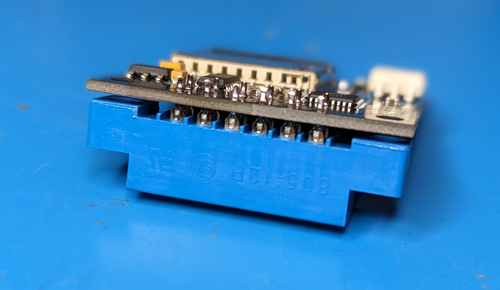
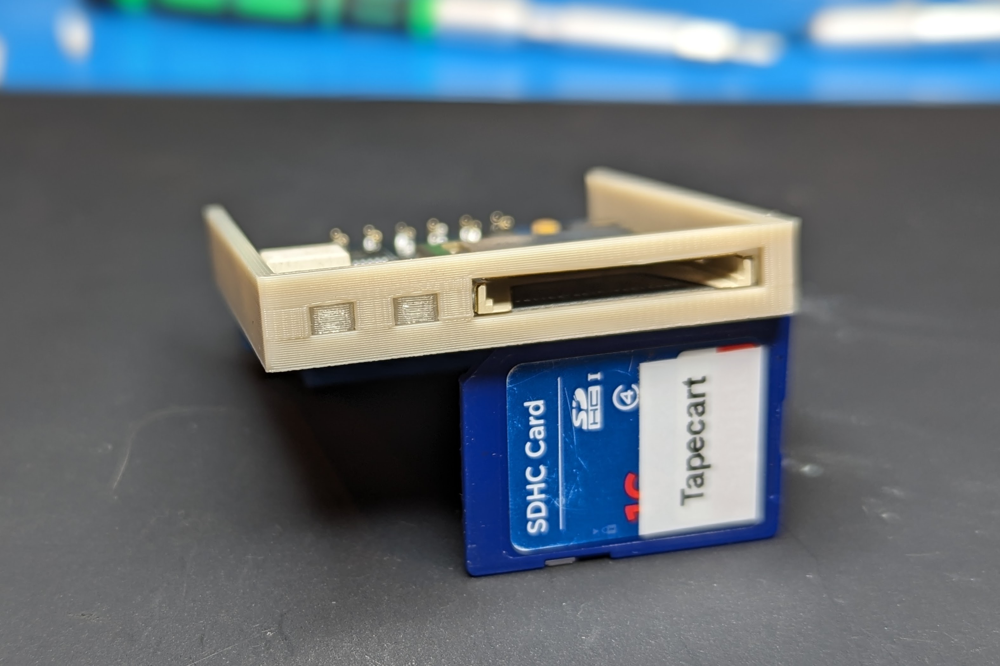
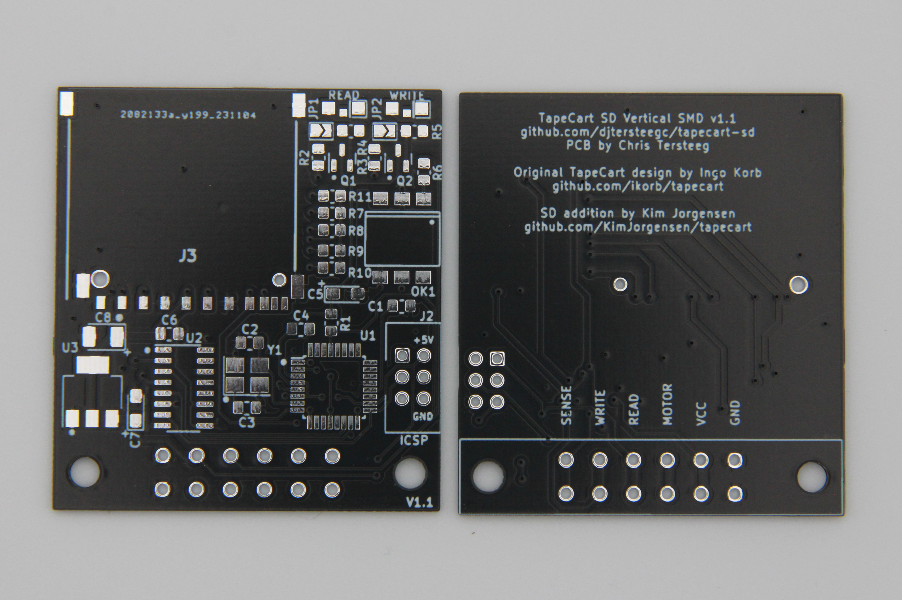

A respin of the [Tapuino](https://github.com/sweetlilmre/tapuino) hardware design for Kim Jorgensen's [Tapecart SD](https://github.com/KimJorgensen/tapecart) firmware that added SD support to Ingo Korb's original [Tapecart](https://github.com/ikorb/tapecart) project for the Commodore 64.  My three design goals for this were:

1. Full sized SD card slot.
2. Physically anchor the edge connector so insertion/removal forces don't stress the solder joints like some of the other designs.
3. SMD to make it as compact as possible, but keep the board single sided and using larger 0805 components with hand solder footprints to make it easy to build.

# Case

The case was created in DesignSpark and available in two different versions.  One with a finger pull handle for easy removal, and one without, but with grip ridges on the sides to aid in removal.  I find the Chinese Jamma/805 connectors from AliExpress to be extra tight on my Commodore's edge connectors, so the handle version is my preferred one.

There are a pair of light pipes that should be printed in transparent material, or you can just leave them off completely. The case is designed to be printed at 0.2mm layer heights and assembled with two M3x16mm screws through the connector body and two M3 nuts pushed into either the handle or lid.

# BOM

There's an interactive BOM [here](https://djtersteegc.github.io/tapecart-sd-vertical/ibom.html), and CSV version with footprint info [here](https://djtersteegc.github.io/tapecart-sd-vertical/bom.csv). The interactive one is super useful when placing the SMD comonents.

C5 is an optional bulk capacitor for the 5V power rail near the MCU.  In my experience building these it is not needed.

The LED's can either be driven directly from the ATmega328P, since they are only drawing ~10ma through the 330R resistors at R4 and R5, by bridging JP1 and JP2. You can also populate R2, R3, Q1, Q2 (leave JP1/2 open in this case) and drive them via a transistor like the original Tapuino design.

The SD card connector is commonly available from several different Chinese suppliers and often called "long body", "non popping", or "push pull" on AliExpress or eBay.

https://www.aliexpress.us/item/3256805779248826.html

Here's some links on LCSC.

https://www.lcsc.com/product-detail/SD-Card-Connectors_Hanbo-Electronic-SD-112_C961673.html

https://www.lcsc.com/product-detail/SD-Card-Connectors_XUNPU-SD-102_C266602.html

https://www.lcsc.com/product-detail/SD-Card-Connectors_Megastar-ZX-SD-282-8Y_C7419835.html

It should also cross with a Wurth 693063010911 or AMP GSD090012SEU if you want something domestically.

# Assembly

Assemble all the SMD components.  I use solder paste hand applied with pnematic dispenser and then finish on a hot plate.  But you can also hand solder, use hot air, or even order a stencil for paste application and use a proper reflow oven. I use a green LED for Read and Red for Write. Make sure to observe polarity with the green stripe on the LED to the right matching the white stripe on the PCB silkscreen.

Do NOT install the 2x3 ICSP pin header at J2.  I would recommend flashing the firmware at this point to do basic checks since it's easier to do board rework before you install the 805 connector.

To install the connector, you will want to print the case back first so it can be used a spacer between the connector and board.  Tighten the screws gently so you can still slide out the case in the future and then solder a couple pins to hold it.  Then slide out the case and do the rest.

When complete it should look something like this.

Press the light pipes into the two LED openings with the lip side facing up and then slide the board in. If you can't slide the PCB under the light pipes, they are installed upside down.  The side mounted LED's should keep the light pipes from falling out, even if they aren't a tight friction fit in the openings.

# Firmware Flashing

The ATmega328P is the same used an Arduino Uno/Nano/Micro, but lacks the necessary bootloader firmware and serial interfaces to flash via the Arduino IDE or programs like XLoader. You could program the chip before installing it with something like a [TL866/T48](TL866/T48) and a [TQFP32 to DIP 32 adapter](https://www.aliexpress.us/item/2251832227450089.html), but I prefer to just use a cheap [UBSASP](https://www.aliexpress.us/item/2251832600419163.html) and [avrdude](https://github.com/avrdudes/avrdude). Make sure you get a 10 pin to 8 pin adapter with the USBASP if it isn't natively an 8 pin model.

Since you didn't solder the 2x3 pin header on the ICSP port J2, you will need to hold the header pins at an angle in the holes to make contact while you run avrdude.  If you're feeling fancy, you could spring for a [2x3 double row 2.54mm test clip](https://www.aliexpress.us/item/3256805646654844.html) or [handheld pogo pin probe](https://www.aliexpress.us/item/3256805545980544.html).  The cheap angle method works fine for me.

The latest Tapecart SD firmware can be downloaded from Kim's repo, https://github.com/KimJorgensen/tapecart/releases

You will be burning the **tapecart.hex** file onto the board and placing the **browser.prg** C64 program on the root of the SD card.

In my [firmware](firmware) directory there are couple of Windows scripts and a test program to ensure your hardware is in good shape before you flash tapecart.hex and connect to your Commodore.

First you to need to setup your ATMega328p with the correct fuse setting so it uses the external 16 MHz crystal, same as an Arduino board. **burn-328p-fuses.cmd** executes the following:

`avrdude -c usbasp -p m328p -B 125kHz -U lfuse:w:0xFF:m -U hfuse:w:0xDE:m -U efuse:w:0x05:m`

Next I have a little test program that will verify the MCU, SD card, and LED's are all correctly wired and working.  **flash-tapecart-sd-test.cmd** will execute:

`avrdude -c usbasp -p m328p -u -U flash:w:tapecart-sd-test.ino.with_bootloader.standard.hex`

If everything is good, you should see the read and write LED's blink together in a loop.  If unable to open the SD card, the write (red) LED will light.  If the SD card is seen but browser.prg cannot be opened, then the read (green) LED will light.  If you don't see any LED's, something is wrong with either the ATMega328p, crystal, or LED wiring.

After everything checks out you can finally flash tapecart.hex with **flash-tapecart.cmd** that executes:

`avrdude -c usbasp -p m328p -u -U flash:w:tapecart.hex`

Plug into your Commodore and enjoy!  The browser program should load with either a **LOAD** command or pressing **SHIFT + RUN  STOP**.

# Getting a Board

If you are in the US, PCB's are available from my Tindie store, [https://www.tindie.com/products/tersteeg/commodore-tapecart-sd-pcb](https://www.tindie.com/products/tersteeg/commodore-tapecart-sd-pcb)

Otherwise you can grab the [gerbers](gerbers) and order from your favorite PCB fab.

# PCB Revisions

### Version 1.0

Q1 and Q2 footprints were incorrectly mapped to the schematic pins.  Could be made to work by wiring bodges directly to the LED current limiting resistors.

### Versions 1.1 (Current)

Fixed Q1/Q2 footprint to schematic mapping.  Added JP1 and JP2 to bypass resistors/transistors for direct operation of LED's from MCU outputs. No known issues.
